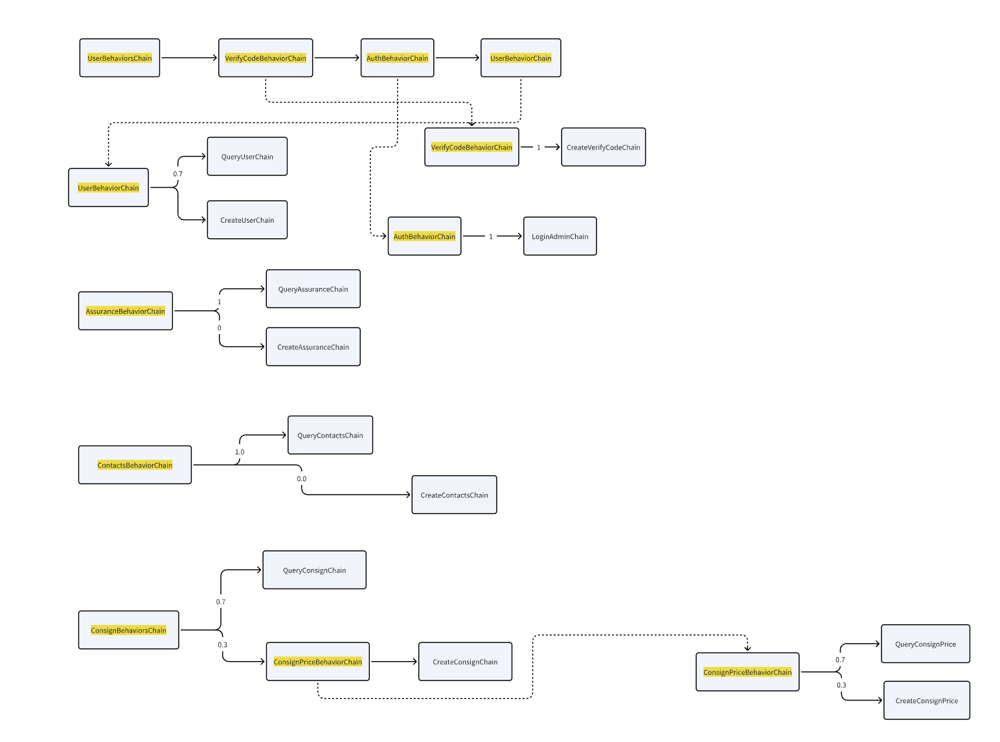
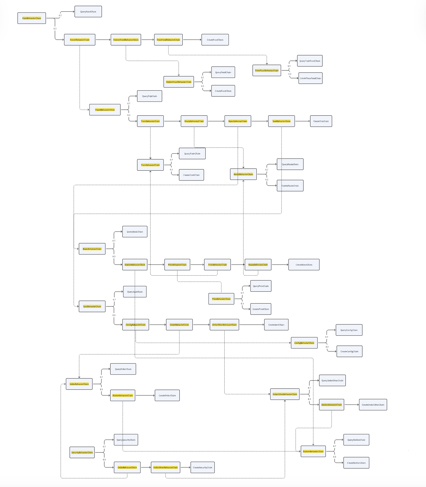
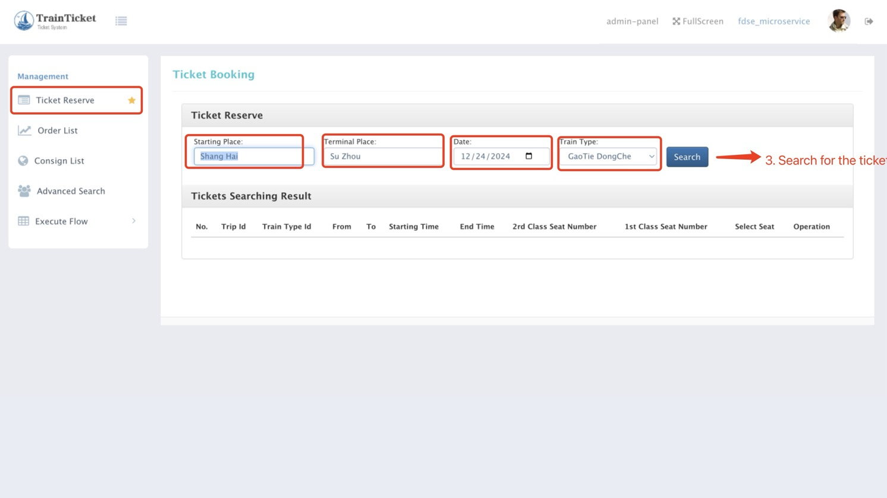
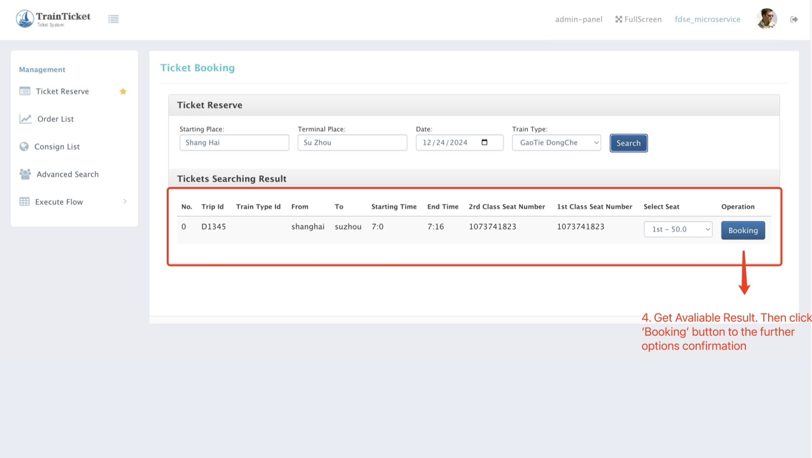
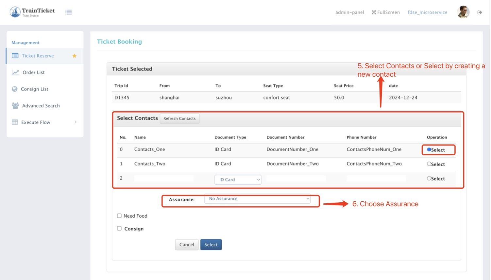
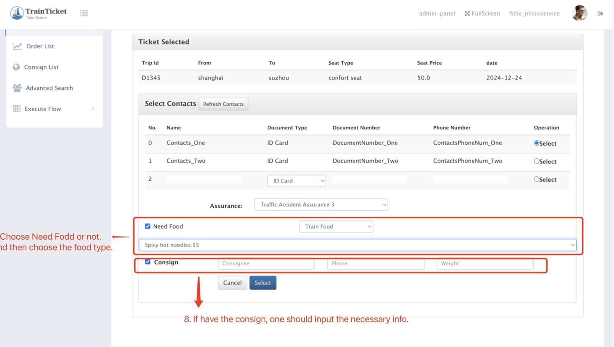
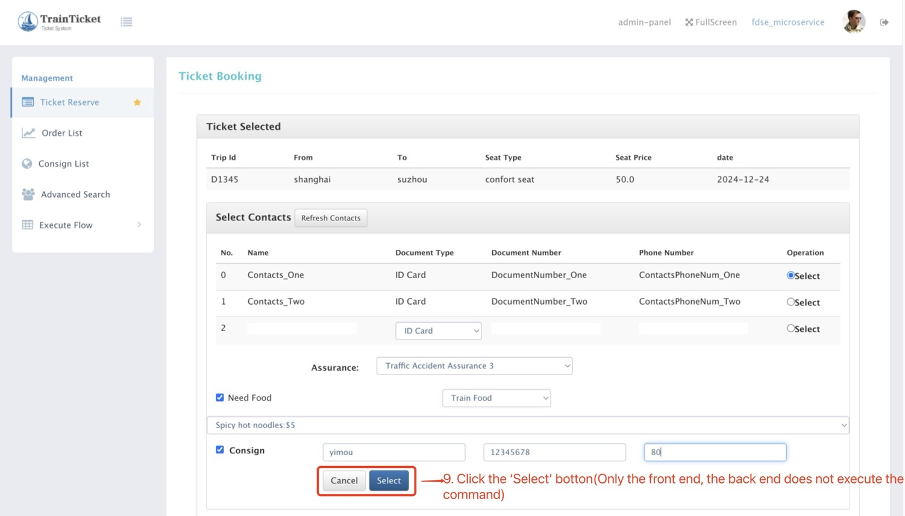
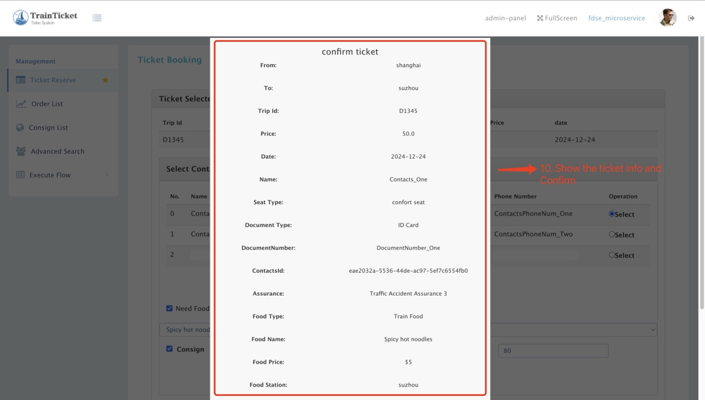
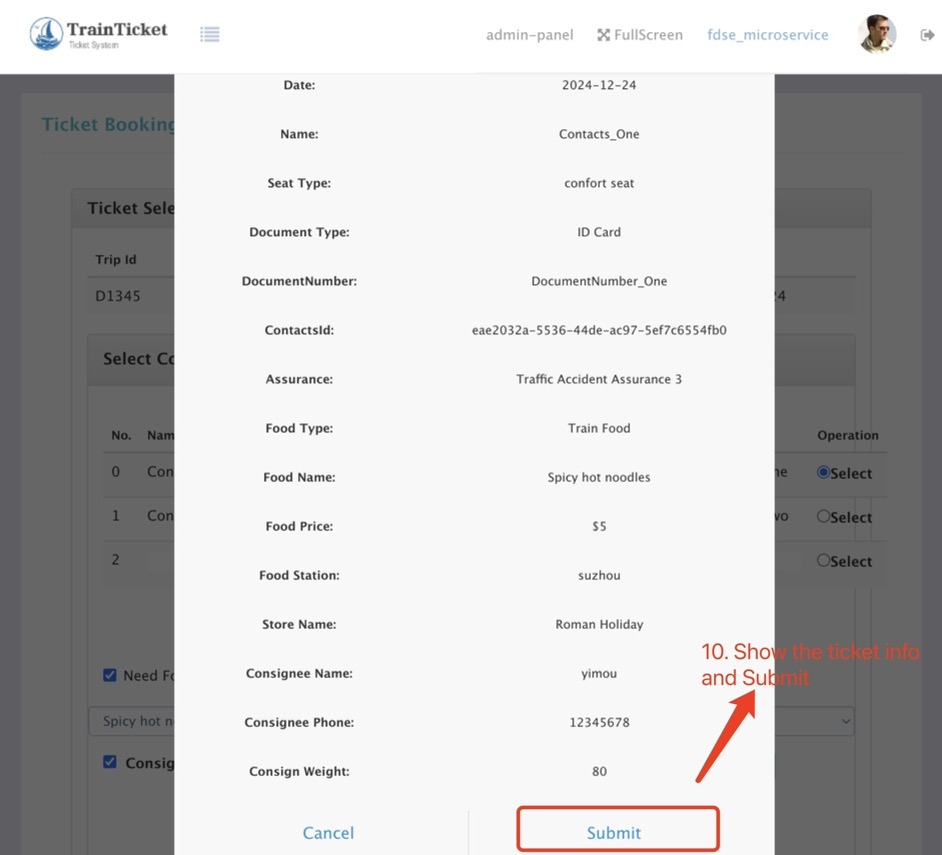

# LoadGenerator (based on 'Train-Ticket' Microservice Systems): A New Version LoadGenerator for Microservice Systems
The Train-Ticket LoadGenerator is a dedicated tool designed to simulate traffic for the Train Ticket Booking System, which is based on a microservice architecture containing 41 microservices. This tool is primarily developed in Go, leveraging its performance and simplicity to effectively test and benchmark the system.

## Behavior Logic Graph
The following graphs illustrate the behavior logic of the Train-Ticket Microservice System.

- The **yellow nodes** represent higher-level classes or components in the system.
- The **arrows** indicate the **invocation relationships** between these components.

These graphs provide a clear visualization of how different parts of the system interact and communicate with each other, offering insights into the overall architecture and dependencies.




### Existing Behavior:

#### • Normal Preserve Chain
Here is the flow for the **Normal Preserve Chain**:

| Step | Image                                                                                     |
|------|-------------------------------------------------------------------------------------------|
| 1    |                                                       |
| 2    |                               |
| 3    |                           |
| 4    |                                 |
| 5    |                                   |
| 6    |  |
| 7    |  |
| 8    |  |
| 9    |                         |
| 10   |  |
| 11   |  |

---

#### • Normal Order Pay Chain
Here is the flow for the **Normal Order Pay Chain**:

| Step | Image                                                                                     |
|------|-------------------------------------------------------------------------------------------|
| 1    |                                                       |
| 2    |                               |

---

#### • Order Consign Chain
Here is the flow for the **Order Consign Chain**:

| Step | Image                                                                                     |
|------|-------------------------------------------------------------------------------------------|
| 1    |                                                       |
| 2    |                               |
---

#### • Ticket Collect and Enter Station Chain
Here is the flow for the **Ticket Collect and Enter Station Chain**:

| Step | Image                                                                                     |
|------|-------------------------------------------------------------------------------------------|
| 1    |                                                       |
| 2    |                               |

---

#### • Advanced Search Chain
Here is the flow for the **Advanced Search Chain**:

| Step | Image                                                                                     |
|------|-------------------------------------------------------------------------------------------|
| 1    |                                                       |
| 2    |                               |

---

#### • Consign List Chain
Here is the flow for the **Consign List Chain**:

| Step | Image                                                                                     |
|------|-------------------------------------------------------------------------------------------|
| 1    |                                                       |
| 2    |                               |

---

#### • Order Change Chain
Here is the flow for the **Order Change Chain**:

| Step | Image                                                                                     |
|------|-------------------------------------------------------------------------------------------|
| 1    |                                                       |
| 2    |                               |

---

#### • Order Cancel Chain
Here is the flow for the **Order Cancel Chain**:

| Step | Image                                                                                     |
|------|-------------------------------------------------------------------------------------------|
| 1    |                                                       |
| 2    |                               |

---

## Environment Setup and Deployment Guide
This guide provides the necessary steps to set up the environment and deploy the application.
#### Prerequisites
To get started, ensure you have the following installed and configured:
1. **Goland IDE**: Recommended for development with Go.
2. **Go Modules**: Run the following command to tidy up dependencies:
   ```bash
   go mod tidy
   ```
#### Deployment and Running the Application
To deploy and run the application, follow these steps:
1. Set the `BASE_URL` environment variable(Replace 'http://10.10.10.220:30080' with the corresponding address):
   ```powershell
   $env:BASE_URL = "http://10.10.10.220:30080"
   ```
2. Start the application:
   ```bash
   go run main.go


   helm upgrade loadgen ./charts/loadgenerator -n experiment --set baseURL=http://10.10.10.220:30081 --set config.threads=1
   ```
That's it! The application should now be running and accessible at the specified `BASE_URL`.


---

For any issues or further details, feel free to check the documentation or raise an issue in the repo :D
